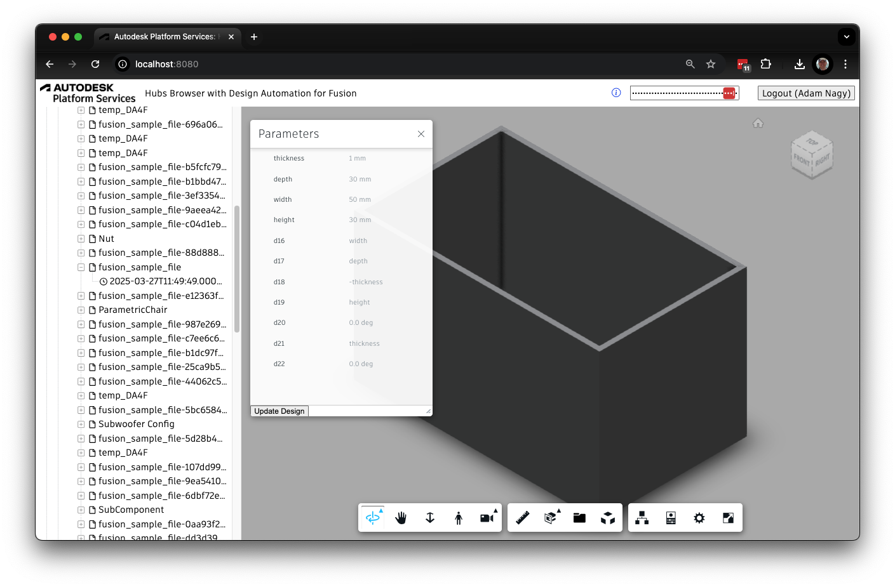

# Configurator for Fusion models 

Based on the [Hubs Browser Tutorial](https://github.com/autodesk-platform-services/aps-hubs-browser-nodejs/blob/develop/README.md) - have a look at that for more details.

## Functionality
Beyond the functionality of that tutorial, this updated version enables users to see all the **Parameters** available in the loaded **Fusion** model.
It also lets you change the parameter values and create a new version of the model with the new parameter values that will be saved in the same folder as the loaded model with a **GUID** attached to the original name.
For this operation the [Design Automation for Fusion](https://aps.autodesk.com/en/docs/design-automation/v3/developers_guide/fusion_specific/) APS component is used.

In order to use that component you need to generate a **Personal Access Token** (PAT) on [https://profile.autodesk.com/Security](https://profile.autodesk.com/Security) for **Design Automation for Fusion** and provide that in the input box. 

## Troubleshooting

Please contact us via https://aps.autodesk.com/en/support/get-help.

## License

This sample is licensed under the terms of the [MIT License](http://opensource.org/licenses/MIT).
Please see the [LICENSE](LICENSE) file for more details.
