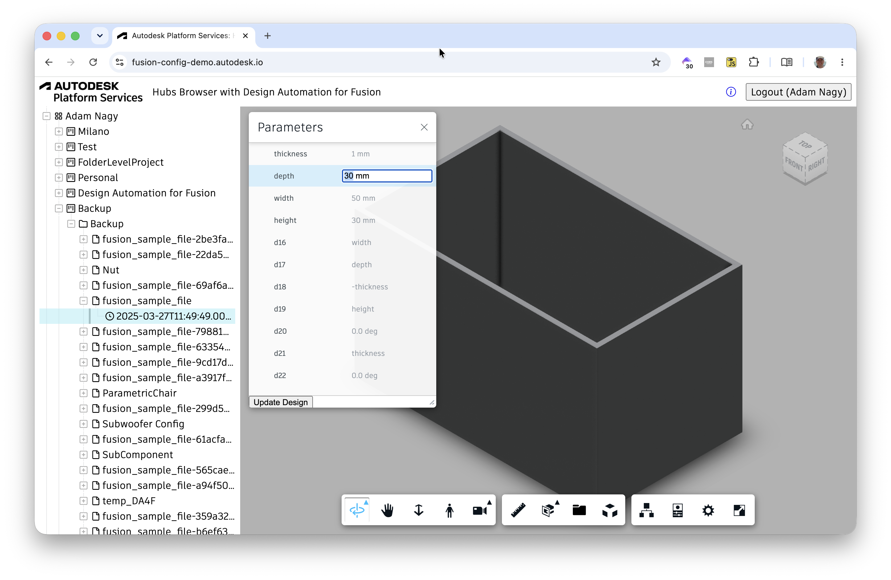

# Configurator for Fusion models 

Based on the [Hubs Browser Tutorial](https://github.com/autodesk-platform-services/aps-hubs-browser-nodejs/blob/develop/README.md) - have a look at that for more details.



## Functionality

Beyond the functionality of that tutorial, this updated version enables users to see all the **Parameters** available in the loaded **Fusion** model.
It also lets you change the parameter values and create a new version of the model with the new parameter values that will be saved in the same folder as the loaded model with a **GUID** attached to the original name.
For this operation the [Design Automation for Fusion](https://aps.autodesk.com/en/docs/design-automation/v3/developers_guide/fusion_specific/) APS component is used.


## Running locally

In order to use this sample you need to do a few things and the easiest is to use the [DA CLI Utility](https://github.com/autodesk-platform-services/aps-da-cli) to do it.

You can use this [config.json](./setup/config.json) with the CLI utility. Just fill in the `clientId`, `clientSecret` and `nickname` (if you did not set it previously then it's the same value as `clientId`) in it then run this task from **VS Code**'s:
- "Activity": this will create the **activity** 

Now create `.env` file in the root of this project with the following content (replace the values with the correct strings):
```
APS_CLIENT_ID="your client id"
APS_CLIENT_SECRET="your client secret"
APS_CALLBACK_URL="http://localhost:8080/api/auth/callback" 
APS_ACTIVITY="<nickname>.ScriptJob+prod"
SERVER_SESSION_SECRET="could be anything you want"
```

## Troubleshooting

Please contact us via https://aps.autodesk.com/en/support/get-help.

## License

This sample is licensed under the terms of the [MIT License](http://opensource.org/licenses/MIT).
Please see the [LICENSE](LICENSE) file for more details.
